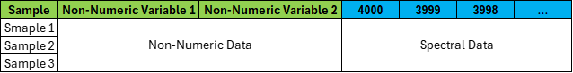

```{r setup, include=FALSE}
knitr::opts_chunk$set(echo = TRUE)
```

```{r Loading Packages, echo = FALSE, message = FALSE, warning = FALSE, results = 'hide'}
library(rstudioapi)
library(readxl)
library(janitor)
library(plotly)
library(writexl)
library(dplyr)
library(htmlwidgets)
library(viridis)
library(gifski)
library(webshot2)
library(gtools)
library(shiny)
```

# 1.0. Introduction

This document provides a guide to the use of the chemRmetrics package in R. chemRmetrics is an accessible package in R that can be used to perform multivaraite statistical analysis on chemical data. 

# 2.0. Installing chemRmetrics

The chemRmetrics package exists in a github repository. To install the package, you must first install the `devtools` pacakge and use the `install_github` function as demonstrated below.

```{r Installing chemRmetrics, eval = FALSE}
install.packages('devtools')
devtools::install_github('mvadamos/chemRmetrics')
```

# 3.0. Loading Data

After loading the package using `library(chemRmetrics)`, you can load your data using the `load_data()` function. Currently, the chemRmetrics package is only capable of loading data in the JCAMP-DX (.JDX) format, or the Microscoft Excel (.xtml) format. Examples of how to load both data formats has been demonstrated below.

## 3.1. Loading Data from JCAMP-DX Files

Before loading data in the .JDX format, the data files must be labelled appropriately. The file label must contain each variable of interest separated by a delimiter of your choice. For example: consider a scenario in which books are being sorted by colour, number of pages, and whether they are hardcover or paperback. An example file title would be `red_200_hardcover`, with an `_` being the delimiter of choice. The `load_data()` function requires the path to the folder containing the .JDX files `inpath` and the file type (JDX) `ftype` to be provided. The naming structure of the files `fstruc` and the delimiter used in this naming structure `delim` must also be provided. See below for an example of how to use the `load_data()` function for loading data from .JDX files:

```{r Loading Data from JDX Files, results = 'hide', message = FALSE, eval = FALSE}
library(chemRmetrics)

raw_data <- load_data('test_data', ftype = 'jdx', fstruc = 'Variable-1_Variable-2_Variable-3', delim = '_')
```

## 3.2. Loading Data from Microsoft Excel Spreadsheets

Before loading data from a Microsoft Excel spreadsheet, the data should be formatted appropriately. All non-numeric variables must be listed in the first 'n' columns, followed by numeric data (e.g. wavenumbers from infrared spectra). See below for an example of how to appropriately format the Excel spreadsheet using data from infrared spectra:



The `load_data()` function requires `inpath` and `ftype` as in the loading of data from .JDX files, with `ftype` changing to 'xlsx'. `fstruc` and `delim` are not required for loading data from an Excel file, however, the number of columns of non-numeric variables `non_num` is required. The following line of code demonstrates how to use the `load_data()` function to load data from an Excel spreadsheet:

```{r Loading Data from an Excel Spreadsheet, eval = FALSE}
raw_data <- load_data('test_data.xlsx', ftype = 'xlsx', non_num = 2)
```

# 4.0. Data Pre-Processing using chemRmetrics

The chemRmetrics package offers 3 methods of data pre-processing including: truncating, interpolating and min-max normalising (normalising to unity).

## 4.1. Truncation

Data truncating in the chemRmetrics package is performed using the `data_trunc()` function. This function requires the dataframe holding the data `df`, the number of columns of non-numeric variables at the start of the data set `non_num`, and the upper `upper` and lower `lower` limits of the range that you would like to remove from the data set. An example has been demonstrated below:

```{r Truncating Data, eval = FALSE}
truncated_data <- data_trunc('raw_data', non_num = 2, upper = 2350, lower = 1850)
```

## 4.2. Interpolation

Data interpolation in the chemRmetrics package is performed using the `data_interp()` function. As in the `data_trunc()` function, the dataframe `df` and the number of columns of non-numeric variables at the start of the data set `non_num` need to be provided. An upper `upper` and lower `lower` range for the interpolation also need to be defined, along with a step size `step`. An example has been displayed in the following line of code:

```{r Interpolating Data, eval = FALSE}
interpolated_data <- data_interp('raw_data', non_num = 2, upper = 4000, lower = 400, step = 1)
```

## 4.3. Min-Max Normalisation

Normalising to unity utilises the `data_norm_mm()` function in the chemRmetrics package. This function only requires the dataframe to be normalised `df` and the number of columns of non-numeric variables at the start of the data set `non_num`. An example is shown below:

```{r Min-Max Normalising Data, eval = FALSE}
normalised_data <- data_norm_mm('raw_data', non_num = 2)
```

# 5.0. Principal Component Analysis in chemRmetrics

Prinicpal component analysis (PCA) in the chemRmetrics package is performed using the `pca()` function. This function requires a dataframe containing your data `df `, the number of columns of non-numeric variables at the start of the data set `non_num`, and the number of principal components (PCs) `num_pcs` to be defined. The `pca()` function will output a scree plot and loadings plots for all PCs in a .pdf format up to the number of PCs defined by the `num_pcs` argument. These plots have been made using a preset of the base R `plot()` function, if you do not like these presets, it is recommended that you create you own plots using either the `plot()` function or another plotting package in R. The data used to make the scree plot and the loadings plots will also be exported at Excel spreadsheets in-case you would like to work with this data in another software. The following chunk of code demonstrates how to use the `pca()` function with an example scree and loadings plot:

```{r Prinicpal Component Analysis, eval = FALSE}
pc_data <- pca('pre-processed_data', non_num = 2, num_pcs = 7)
```


Within the chemRmetrics pacakge, there is also an option to overlay two laodings plots using the `loadings_olay()` function. This function requires the name of the loadings data excel file `infile` from the `pca()` function to be defined. The PC numbers that you would like to be overlain `pc_num_1` and `pc_num_2` also need to be defined. An example has been shown below: 

```{r Overlaying Loadings Plots, eval = FALSE}
loadings_olay('Loadings_Data.xlsx', 1, 2)
```


## 5.1. Projection onto PCA Model

The chemRmetrics model also provides the option to project a new dataset onto an existing PCA model. This is achieved by using the `pca_proj()` function. The two data frames `df` and `df_proj` must first be defined, corresponding the data set used to create the PCA model and the data set that you would like to project onto this PCA model, respectively. The `non_num` and `num_pcs` arguments are to be used the same as they were when using the `pca()` function. It should be noted that the data set to be projected onto the PCA model should be subject to the same pre-processing as the data set used to make the model. The follwing line of code demonstrates how to use the `pca_proj()` function:

```{r Projection onto PCA Model, eval = FALSE}
pc_data_proj <- pca_proj('pre-processed_data', 'projection_data', non_num = 2, num_pcs = 7)
```

## 5.2. Data Visualisation

The `pca()` and `pca_proj()` functions create a data frame with the original data + PCA scores in the last n columns (n = number of PCs selected). The PCA scores can be plotted as either a 2D or 3D PCA scores plot, with the option to create a gif of a rotating 3D PCA scores plot. The `plot_2D()` and `plot_3D()` functions in the chemRmetrics package use `plotly` presets that the creator of the package prefers. It is recommended that you use the `plotly` package or another plotting package to create your own plots if you are not happy with the preset plot formatting. 

### 5.2.1. Creating a 2D PCA Scores Plot

To plot a 2D PCA scores plot, you can used the `plot_2D()` function in the chemRmetrics package, or you can export the data frame containing the PCA scores and create the plot in another software choice. The `plot_2d()` function requires the data frame holding the PCA scores `df` and the variable that you would like to be colour coded in the plot `variable` (this has to match the column name of the variable in the data frame). The two PCs that you would to plot `pc_num_1` and `pc_num_2` must also be defined. The default colour palette is a rainbow palette, to choose your own colours you can use the `colours` argument. This argument should be a list of colours separated using ', '
(e.g 'red, green, blue'). These colours can also be [html colour codes](https://htmlcolorcodes.com/). The number of colours provided must be equal to or greater than the number of unique classes for the variable chosen. See below for an example of how to use the `plot_2D()` function:

```{r Creating a 2D PCA Scores Plot, eval = FALSE}
plot_2D(pc_data, variable = 'Colour', 1, 2)
```

```{r Display 2D PCA Scores Plot, echo = FALSE}
library(ChemRmetrics)

Raw_Spectra <- load_data('Test Data', 6, 'jdx', 'Brand_Filament-Type_Colour_Form_Repetition', '_')

num_pcs <- 7
var_name <- "Colour"
var_col <- 3
non_num <- 6

og_var_name <- colnames(Raw_Spectra[var_col])
colnames(Raw_Spectra)[var_col] <- 'Variable'
myPr <- prcomp(Raw_Spectra[, -c(1:non_num)], rank.= num_pcs)
pcplot <- cbind(Raw_Spectra, myPr$x[,1:num_pcs])

pcplot_title_2D <- 'Test 2D PC Scores Plot'

fig_2D <- plot_ly(pcplot, x = ~PC1, y = ~PC2, type = 'scatter', mode = 'markers', color = pcplot$Colour, 
colors = rainbow(13))

fig_2D <- fig_2D %>%
  layout(
    title = pcplot_title_2D,
    scene = list(bgcolor = "#FFFFFF"),
    xaxis = list(zeroline = F,showline = T, showgrid = FALSE, ticks = 'outside'),
    yaxis = list(zeroline = F, showline = T, showgrid = FALSE, ticks = 'outside'))

div(fig_2D, align = 'center')
```

### 5.2.2. Creating a 3D PCA Scores Plot

An interactable 3D PCA scores plot can be created using the `plot_3D()` function in the chemRmetrics package. Similar to the `plot_2D()` function, the data frame holding the PCA scores `df` and the variable that you would like to be colour coded in the plot `variable` must be defined. The 3 PCs you would like to plot `pc_num_1`, `pc_num_2`, and `pc_num_3` must also be provided. See section 5.2.1. for a description of how the `colours` argument works. The following line of code demonstrates how to use the `plot_3D()` function:

```{r Creating a 3D PCA Scores Plot, eval = FALSE}
plot_3D(pc_data, Variable = 'Colour', 1, 2, 3)
```

```{r Display 3D PCA Scores Plot, echo = FALSE}
pcplot_title_3D <- 'Test 3D PC Scores Plot'

fig_3D <- (plot_ly(pcplot, x = ~PC1, y = ~PC2, z = ~PC3, color = pcplot$Colour, 
colors = rainbow(13)) %>%
  add_markers(size = 12))

fig_3D <- fig_3D %>%
  layout(
    title = pcplot_title_3D,
    scene = list(bgcolor = "#FFFFFF",
    aspectmode = "cube",
    xaxis = list(zeroline = F,showline = T, mirror = T, ticks = 'outside'),
    yaxis = list(zeroline = F, showline = T, mirror = T, ticks = 'outside'),
    zaxis = list(zeroline = F,showline = T,mirror = T, ticks = 'outside'))
  )

div(fig_3D, align = 'center')
```

### 5.2.3. Creating a Rotating 3D Scores Plot GIF

A rotating 3D score plots can be created using the `create_3D_gif()` function in the chemRmetrics package. This function requires the `df`, `variable`, `pc_num_1`, `pc_num_2`,`pc_num_3` and `colours` arguments to be defined as in the use of the `plot_3D()` function. The number of images that will collated to create the gif `num_images` also needs to be defined. The following line of code demonstrates how to use the `create_3D_gif()` function:

```{r Creating a Roatating 3D PCA Scores Plot GIF, eval = FALSE}
create_3D_gif(pc_data, variable = 'colour', 1, 2, 3, num_images = 100)
```

.gif)

# 6.0. Session Info
```{r Session Info, eval = TRUE, echo = FALSE}
sessionInfo()
```
